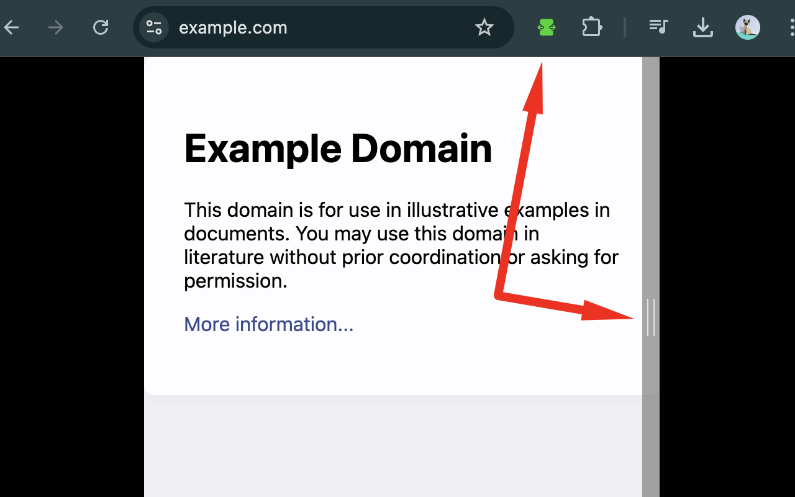

# Viewport Resizer Chrome Extension

Viewport Resizer is a Chrome extension designed for web developers and designers. It allows users to resize a website's viewport horizontally without changing the browser window size, making it a great tool for testing responsive designs and viewing websites at specific widths.

## Key Features

- Easily resize the viewport by dragging a resizable bar
- Display current viewport width in pixels
- Double-click the resize bar to expand to full width
- Automatically save the last used width for each site

## Usage

- Click the extension icon to activate the resizer on the current page
- Drag the resize bar to adjust the viewport width
- View the current width in pixels displayed near the resize bar
- Double-click the resize bar to expand to full width
- Click the extension icon again to deactivate the resizer and return to normal browsing
